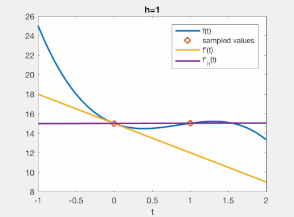

# Introduction
Finite-difference (FD) methods are ways to approximate a function or its derivatives at a given point, by computing a weighted sum of some input values. 

An example. If your thermometer says it's $20^\circ$ C in the house at 10:00 AM, and $22^\circ$ C at 11:00 AM, then you may assume that it was about $(\tfrac{1}{2}20+\tfrac{1}{2}22)=21^\circ$ C at 10:30 AM. The factors $\tfrac{1}{2}$ are the so-called 'finite-difference coefficients'. Furthermore, you can compute that the temperature increased by $(-20+22)/1=2^\circ\text{ C}/hour$, where the factors $\pm 1$ are again so-called FD coefficients, now computing the derivative of the temperature function.

The power of the FD method is that you can compute function values or their derivatives, using only $+$, $-$, $\times$ and $\div$ operations. This is the kind of operation that a computer loves doing all the time! They're called computers for a reason.

At university, students will typically be introduced to the FD method in one of the following six ways that I describe below. That's fine. I think, however, that there is something to be gained by understanding the various different conceptualizations of the FD operator. Just as [there are many ways in which we can understand a derivative (see p. 3)](https://arxiv.org/pdf/math/9404236.pdf), they all add to a unified picture of what it means to use an FD approximation.

I have collected these different perspectives during the course of my PhD primarily. They are thus focused primarily on solving differential equations.

# 1 -- Approximating (the concept of) a derivative
Typical introductions to the FD method start out by looking at derivatives. This is how we will approximate the first three ways to conceptualize the FD method.

## 1.1 The finite-difference method approximating a limit
In high-school you probably learned to define a derivative with some kind of 'limit' operation,

$$ f'(x) \equiv \lim_{h\to 0} \frac{f(x+h)-f(x)}{h}. $$

Limits are typically computed with [symbolic manipulation](https://en.wikipedia.org/wiki/(ε,_δ)-definition_of_limit), i.e., with a pen and a piece of paper. But we want a direct computation with the computer instead. Unfortunately, if we try to compute the limit with direct assignment, we get a problem: $ \frac{f(x+h)-f(x)}{h}\bigg|_{h=0} = \frac{0}{0} = \text{NaN}$. Here, $\text{NaN}$ means 'not a number', as we're doing [division by zero](https://en.wikipedia.org/wiki/Division_by_zero). Not very useful.

So, what's the closest thing we can do instead? We can define a parameterized function $f'_h$ as $ f_h'(x) \equiv \frac{f(x+h)-f(x)}{h} $ for which it holds that

$$ \lim_{h\to 0} f_h'(x) = f'(x). $$

Now, if we evaluate $f_h'$ for a *very small* value of $h$, we will get a good approximation of $f'(x)$. This is what you see in the gif, below, for some arbitrary function.

Hence, this understanding of the FD operator is: we approximate a limit with a small number. For small (but non-zero!) values of $h$, this intuitively does a good job for most functions. That is about as far as this understanding gets us!

## 1.2. The finite-difference method as polynomial interpolation
Now let's use a very different approach. Say there's an unknown function $f(x)=2x^2$, whose values at locations $x_n=\{-1,0,1\}$ are $f(x_n)=\{2,0,2\}$. Then, we can create an interpolating polynomial, $P(x)=2x^2$ which creates a continuous function based on the sampled data. We can then differentiate this polynomial $n$ times, and evaluate $P^{n}(x)$ for any desired location $x$.
It may not be obvious at outset, but this is exactly what the FD coefficients do. Except that they perform all steps at once!

The way to see this is to first [write the interpolating Polynomial in Lagrange form](https://en.wikipedia.org/wiki/Lagrange_polynomial). Our example would yield

$$ P(x) = \frac{x_2-x}{x_2-x_1}\frac{x_3-x}{x_3-x_1}f(x_1) + \frac{x_1-x}{x_1-x_2}\frac{x_3-x}{x_3-x_2}f(x_2) + \frac{x_1-x}{x_1-x_3}\frac{x_2-x}{x_2-x_3}f(x_3) , $$

(which still corresponds to $P(x)=2x^2$ if you would rewrite it -- but this is not the direction we pursue!) With $\{x_1,x_2,x_3\}=\{-1,0,1\}, that becomes specifically

$$ P(x) = \frac{-x}{1}\frac{1-x}{2}f(x_1) + \frac{-1-x}{-1}\frac{1-x}{1}f(x_2) + \frac{-1-x}{-2}\frac{-x}{-1}f(x_3) . $$

If we choose any specific location, say $x=0.5$, we could write:

$$ P(0.5) = \frac{-1}{8}f(x_1) + \frac{3}{4} f(x_2) + \frac{3}{8} f(x_3). $$

With our specific function values, that results in $P(0.5)=-2/8+0+6/8=1/2$, which is correct! Note that this expression has the same form as an FD operator: a weighted sum of the input values! **In other words, through first finding an interpolating polynomial in Lagrange form, and then choosing a specific evaluation point, we obtained the FD operator!** You can compare the results with [an online FD coefficient calculator](https://web.media.mit.edu/~crtaylor/calculator.html), which for inputs $-1.5,-0.5,0.5$ gives coefficients $-1/8, 3/4, 3/8$ respectively, exactly what we found!

I show the results of this operation below, where a function is sampled at 11 points (between -10 and +10 at every 2nd step), which is then interpolated (continuous dashed line), and separately the FD approximation is computed (yellow dots). You can see that the two yield identical results.

We can do the same for the derivative (which is $f'(x)=4x$, but as of yet unknown to us). We differentiate the interpolating polynomial using the chain rule,

$$ P'(x) = \left( \frac{-x}{x_2-x_1}\frac{x_3-x}{x_3-x_1} + \frac{x_2-x}{x_2-x_1}\frac{-x}{x_3-x_1}\right)f(x_1) + \left( \frac{-x}{x_1-x_2}\frac{x_3-x}{x_3-x_2} + \frac{x_1-x}{x_1-x_2}\frac{-x}{x_3-x_2} \right)f(x_2) + \left( \frac{-x}{x_1-x_3}\frac{x_2-x}{x_2-x_3} + \frac{x_1-x}{x_1-x_3}\frac{-x}{x_2-x_3} \right)f(x_3) , $$

which for our specific sample locations $x_n$ and output location $x=0.5$ provides

$$ P'(0.5) = 0f(x_1) - f(x_2) + f(x_3) = 2, $$

which is correct, as $f'(0.5)=2$. **Again, we have obtained an FD operator, through finding the interpolating polynomial, which we differentiated, and then evaluate at a specific position!**

Hence, this understanding of the FD operator is: it is the shortcut of (1) creating an interpolating polynomial from function values, (2) differentiating it $n$ times, (3) evaluating the resulting operator at any given location. This understanding tells us anything that applies to interpolation also: we need enough samples to capture non-linear behavior, we will get poor performance towards the edges of the interpolation (i.e., be *very* careful when evaluating FD results towards the edge of an equidistantly sampled function), etcetera!

## 1.3. The finite-difference method with Taylor expansions
In the previous section we have deepened our knowledge, by observing that FD operators simply correspond to interpolation+evaluation. Furthermore, it provides a straightforward (and explicit) strategy to compute FD coefficients with ease. We will now turn the problem on its head, and pretend that we can write each sampled value in terms of a Taylor expansion around 0 (so, really, a Maclaurin series),

$$ f(x) = f(0) + x\frac{f'(0)}{1!} + x^2\frac{f''(0)}{2!} + \dots = \sum_{k=0}^\infty x^k \frac{f^{(n)}(0)}{k!}. $$

For example, with the same example we saw thus far, we had three sample locations $\{-1,0,1\}$ with associated values $\{2,0,2\}. We will write down the Taylor expansion for each of these terms to the 3rd term. I will use a matrix-vector notation, the use of which will be clear soon.

$$
\begin{pmatrix} f(-1) \\ f(0) \\ f(1) \end{pmatrix} = \begin{pmatrix} 2 \\ 0 \\ 2 \end{pmatrix} \approx \begin{pmatrix} (-1)^0 & (-1)^1 & (-1)^2 \\ (0)^0 & (0)^1 & (0)^2 \\ 1^0 & 1^1 & 1^2   \end{pmatrix}\begin{pmatrix} f(0) \\ \frac{f'(0)}(1!) \\ \frac{f''(0)}{2!} \end{pmatrix},
$$

where we used $\approx$ just because we truncated the Taylor expansion at three terms. Now, we invert this system,

$$
\begin{pmatrix} (-1)^0 & (-1)^1 & (-1)^2 \\ (0)^0 & (0)^1 & (0)^2 \\ 1^0 & 1^1 & 1^2   \end{pmatrix}^{-1}\begin{pmatrix} f(-1) \\ f(0) \\ f(1) \end{pmatrix} = \begin{pmatrix} 2 \\ 0 \\ 2 \end{pmatrix} = \begin{pmatrix} f(0) \\ \frac{f'(0)}(1!) \\ \frac{f''(0)}{2!} \end{pmatrix},
$$

and we pre-multiply with a column vector,

$$
\begin{pmatrix} 0&1&0 \end{pmatrix}\begin{pmatrix} (-1)^0 & (-1)^1 & (-1)^2 \\ (0)^0 & (0)^1 & (0)^2 \\ 1^0 & 1^1 & 1^2   \end{pmatrix}^{-1}\begin{pmatrix} f(-1) \\ f(0) \\ f(1) \end{pmatrix} = \begin{pmatrix} 0&1&0\end{pmatrix}\begin{pmatrix} f(0) \\ \frac{f'(0)}(1!) \\ \frac{f''(0)}{2!}\end{pmatrix} = f'(0).
$$

Thus, if we solve this system on the left-hand side (e.g., with MATLAB), we find 

$$
\begin{pmatrix} -\frac{1}{2} & 0 & \frac{1}{2} \end{pmatrix}\begin{pmatrix} f(-1) \\ f(0) \\ f(1) \end{pmatrix} = f'(0).
$$

Hey, $\pm\tfrac{1}{2}$ are [the FD coefficients for this problem](https://web.media.mit.edu/~crtaylor/calculator.html), which give $f'(0)=0$, found neatly through inverting a system! The biggest approximation we've made is the sudden change from $\approx$ to $=$ in the linear system. What does that tell us? We assume that $f(x)$ could indeed be well-described by a function $f(x)=f(0)+af'(x)/1+a^2f''(x)/2$, without needing the further expansion coefficients. But we can now take our system further:

$$
\begin{pmatrix} f(-1) \\ f(0) \\ f(1) \end{pmatrix} = \begin{pmatrix} 2 \\ 0 \\ 2 \end{pmatrix} \approx \begin{pmatrix} (-1)^0 & (-1)^1 & (-1)^2 & (-1)^3 & (-1)^4 \\ (0)^0 & (0)^1 & (0)^2 & (0)^3 & (0)^4 \\ 1^0 & 1^1 & 1^2 & 1^3 & 1^4  \end{pmatrix}\begin{pmatrix} f(0) \\ \frac{f'(0)}(1!) \\ \frac{f''(0)}{2!} \\ \frac{f^{(3)}(0)}{3!} \\ \frac{f^{(4)}}(0}{4!} \end{pmatrix},
$$

and pre-multiply with the found FD coefficients,

\begin{align}
\begin{pmatrix} -\frac{1}{2} & 0 & \frac{1}{2} \end{pmatrix}\begin{pmatrix} f(-1) \\ f(0) \\ f(1) \end{pmatrix} &= \begin{pmatrix} -\frac{1}{2} & 0 & \frac{1}{2} \end{pmatrix}\begin{pmatrix} 2 \\ 0 \\ 2 \end{pmatrix} \approx \begin{pmatrix} (-1)^0 & (-1)^1 & (-1)^2 & (-1)^3 & (-1)^4 \\ (0)^0 & (0)^1 & (0)^2 & (0)^3 & (0)^4 \\ 1^0 & 1^1 & 1^2 & 1^3 & 1^4  \end{pmatrix}\begin{pmatrix} f(0) \\ \frac{f'(0)}(1!) \\ \frac{f''(0)}{2!} \\ \frac{f^{(3)}(0)}{3!} & \frac{f^{(4)}(0){4!} \end{pmatrix},\\
& = \begin{pmatrix} 0 & 1 & 0 & 1 & 0 \end{pmatrix}\begin{pmatrix} f(0) \\ \frac{f'(0)}(1!) \\ \frac{f''(0)}{2!} \\ \frac{f^{(3)}(0)}{3!} & \frac{f^{(4)}(4!) \end{pmatrix},\\
& = f'(0) + \frac{f^{(3)}(0)}{6}.
\end{align}

This finding means the following. If we use our FD coefficients $\{-\tfrac{1}{2},0,\tfrac{1}{2}\}$ on an arbitrary function, we will return 0 times $f(0)$, once $f'(0)$, and zero times $f''(0)$. Furthermore, however, we will compute $f^{(3)}(0)/6$ once, and $f^{(4)}(0)$ zero times. Etcetera. Hence, if the function that we are applying the FD coefficients on has $f^{(3)}(0)\neq 0$, our FD operator is erroneous (and similar for higher derivatives not included in this series).

Now we're making real progress! With the first insight, we intuitively saw that FD operators simply approximate a limit procedure, without understanding their accuracy. With the second insight, we saw that FD operators really just carry out interpolation+evaluation, meaning that the accuracy is only as good as our interpolation. With this third insight, we start to understand that the accuracy of the FD operator is inherently related to *how well the function is approximated with a truncated Taylor series*! We can use this assumption to find FD coefficients, and we can use this assumption to show from which derivative order the FD system starts to create errors.

Hence, this understanding of the FD operator is that each of the $N$ sampled function values may be expressed in terms of its own degree $N-1$ Taylor polynomial, and we simply find the FD coefficients such that all but one of the $f^{(n)}(0)$ terms are cancelled.
Expansion of this system to more terms, then tells you the error made by your FD coefficients, in terms of a Taylor expansion.
This is the most standard introduction to FD operators, but here perhaps made in a somewhat novel fashion.

## 1.4. The finite-difference method in the Fourier domain
Thus far, we have studied FD operators in the space of the sampled functions themselves. This has led us to some interesting insights in terms of Taylor expansions, even if those Taylor expansions are not always available. An entirely different perspective is available to us if we consider the FD method in the Fourier domain. Defining the Fourier transform as

$$
\widehat{f}(k) = \int_{-\infty}^\infty f(x)e^{-ikx}\text{d}\! x,
$$

we can use the partial integration rule $(f'g=fg-fg')$ to find

$$
\widehat{\frac{\text{d}f}{\text{d}x}}(k) = \int_{-\infty}^\infty \frac{\text{d}f(x)}{\text{d}x}e^{-ikx}\text{d}\! x = \left. f(x)e^{-ikx}\right|_{x=-\infty}^\infty + \int_{-\infty}^\infty f(x) (ik) e^{-ikx} \text{d}\! x = (ik) \widehat{f}(k),
$$

such that for a 'nice' $f(x)$ which vanishes at $\pm \infty$, we have that derivatives simply correspond to multiplication with $(ik)$ in the Fourier domain:

$$
\widehat{\frac{\text{d}^nf}{\text{d}x^n}}(k) = (ik)^n \widehat{f}(k).
$$

So, whereas the 'target' for the FD coefficients in the previous section was to cancel as many Taylor coefficients as possible, the target of our FD coefficients now is to approximation $(ik)^n$ as well as possible!

We can consider the same example as in the previous section. We found that for samples at $\{-1,0,1\}$, we approximate the first-derivative by computing $f'(0)\approx-\tfrac{1}{2}f(-1)+\tfrac{1}{2}f(1)$. Let's see what that looks like in the Fourier domain. Well -- samples are not so interesting in the Fourier domain. But we can generalize our expression to find $f'(x)\approx -\tfrac{1}{2}f(x-1)+\tfrac{1}{2}f(x+1)$, and look at that. The shift property of the Fourier transform is

$$
\widehat{f(\cdot+1)}(k) = \int_{-\infty}^\infty p(x+1) e^{-ikx} \text{d} x = \int_{-\infty}^\infty p(u) e^{-ik(u-1)}\text{d}\!u = e^{ik}\widehat{f}(k),
$$

such that the Fourier transform of the FD operator is

$$
\widehat{\left(-\tfrac{1}{2}f(\cdot-1)+\tfrac{1}{2}f(\cdot+1)\right)}(k) = \frac{e^{ik}-e^{-ik}}{2} \widehat{f}(k).
$$

Using Euler's formula $e^{ik}=\cos(k)+i\sin(k)$, we find that our result may also be written as

$$
\widehat{\left(-\tfrac{1}{2}f(\cdot-1)+\tfrac{1}{2}f(\cdot+1)\right)}(k) = \left(i\sin(k)\right) \widehat{f}(k).
$$

Okay, let's see where we are. We want to compute a first-order derivative. The true derivative would be given as $(ik)\widehat{f}(k)$. Instead, our FD operator returns $\left( i\sin(k) \right) \widehat{f}(k)$. Aha! We now have an entirely novel insight into the accuracy of our FD operator! For low values of $k$, we have that $\sin(k)\approx k$, thus for low wavenumbers/frequencies in $f$, our FD operator returns the correct solution. For higher wavenumbers/frequencies, the FD operator is erroneous!

This type of analysis can always be carried out. The nice trigonometric properties only appear when we have an equal amount of samples taken on both the left and right of our FD operator, otherwise we're left with seperate $e^{ik\Delta x}$ values, which hamper the identification. 
This type of analysis is extremely powerful, and was the primary way in which I studied FD operators in my PhD thesis. 
It allows all kinds of additional steps. For example, FD operators can be built to better approximate $(ik)^n$ for a large range of frequencies. What then typically happens is that not all the terms in a Taylor expansion are appropriately cancelled, but we achieve better performance over a larger frequency range, typically suffering less from edge artifacts too.
The idea is really as follows: if your data is well-described by polynomials, create and study the FD operator using Taylor expansions. If your data is well-described by sinusoidals, create and study the FD operator in the Fourier domain!

Although a proper understanding comes from writing a number of FD operators in the form described here, we can give some visual representation of the problem. Consider a [chirp function](https://en.wikipedia.org/wiki/Chirp), which is given as a signal $x(t)=\sin(c\pi t^2)$ for some constant $c$ that gives the speed of the chirp, which is simply a function that linearly increases in frequency. The derivative of a chirp function is simply $x'(t)=2c\pi t\cos(c\pi t^2)$. 

If we apply the operator $\{-0.5,0,0.5\}$ to this function, and plot the misfit against the true derivative, we find

What you can see is that the misfit increases for increasing frequencies.

If, instead we apply the operator $\{-0.50006525,0,0.50006525\}$, we find 

What you can now see is that the new FD coefficients "balance" the misfit. Even though it increases initially, it comes back down again for medium frequencies, before again rising for larger frequencies.

To conclude, this understanding of FD operators considers their effect in the Fourier domain. It takes an entirely new perspective on the accuracy of FD operators, by looking at how well they describe sinusoidal functions. We can even design FD operators that minimize the misfit for a range of frequencies -- at the expense of performing less well from a Taylor-series perspective.
The take-home message is that some prior knowledge about the type of data (polynomial or sinusoidal) can help us design better FD coefficients.
The Fourier perspective is incredibly powerful way to study the effect of FD operators, also in combination with the differential equation that's being approximated. Nearly everything I did in my PhD thesis was found through this perspective.

# 2 -- Using an FD method together with a differential equation
We rarely use the FD method in isolation; typically, they're used in the setting of an equation. For example, we have some equation of the form (typically, $x$ may be replace with $t$ to describe problems that are dynamic in time)

$$ \frac{\text{d}f(x)}{\text{d}x} = g(x,f(x)) $$

Now, we write down an approximation with $(f(x+h)-f(x))/h$, and manipulate it into the following form

$$ f(x+h) - f(x) = h\cdot g(x,f(x)) $$

This equation can then be solved for future values, $f(x+h) = f(x) + h\cdot g(x,f(x))$. This is a truly magical feature of the FD methods. It turns differential equations into simple $+$, $-$, $\times$ and $\div$ operations.

## 2.1. The finite-difference method as exact evaluation of integral
So far, we've assumed that our FD operator is essentially an approximation. Perhaps confusingly, we do not necessarily have to look at it in this way! Starting with our evolution equation $f'(x)=g(x,f(x))$, we integrate from $x$ to $x+h$ to find

$$ \int_{x}^{x+h} f'(x) \text{d}\! x = f(x+h) - f(x) = \int_x^{x+h} g(x,f(x)) \text{d}\! x. $$

The magical thing? With the previous definition, we derived the relation $f(x+h)-f(x)=h\cdot g(x,f(x))$ in a hand-wavy way. Now, we have derived the very same left-hand side in a *precise* form, using the fundamental theorem of calculus. There is no approximation involved!

However, our issues haven't gone away. Unless we can nicely integrate the right-hand side (by knowing $G=\int g\text{d}\! x$), we have to now choose how we want to integrate $g$ over the interval. The simplest thing to do is to make the approximation that $g$ does not change much over the interval $[x,x+h]$, such that we can approximate

$$ f(x+h) - f(x) = \int_x^{x+h} g(x,f(x)) \text{d}\! x \approx g(x,f(x)) \int_x^{x+h} \text{d}\! x = g(x,f(x))\cdot h. $$

and this has brought us back right to where we were, the same FD equation as before! However, we start to get a better grip on the problem. It is clear that we use a poor approximation of $g$, and it is clear that we can use other (better) numerical integration methods. This is where [Runge-Kutta methods](https://en.wikipedia.org/wiki/Runge–Kutta_methods) and other techniques come into form, which are essentially ways to better appproximate the integral of $g$ by using intermediate evaluations (or approximations) of $g$ in the interval $[x,x+h]$. 

Hence, considering the FD method not in isolation, but in the context of a differential equation, we could give an *exact* FD step. However, we're left with another integral which must still be found numerically. However, there is a vast theory to help you numerically integrate all kinds of problems!

## 2.2. The finite-difference method as an infinite series of the differential equation
The final perspective on FD operators is a hybrid form. We first choose some approximation of $f'(x)$, and express its performance in terms of a Taylor series. Then, we replace derivatives in the Taylor series with the known differential equation. For example, a Taylor expansion of the following simple FD operator may be written as

$$ \frac{f(x+h)-f(x)}{h} = f'(x) + h\frac{f''(x)}{2!} + \dots = \sum_{k=1}^\infty \frac{f^{(k)}(x)}{k!}. $$

Now, we use that $f'(x)=g(x,f(x))$. Similarly, $f''(x)=g'(x,f(x))$, etc. Then, we find that

$$ \frac{f(x+h)-f(x)}{h} = g(x,f(x)) + hg'(x,f(x)) + \dots = \sum_{k=1}^\infty \frac{g^{(k-1)}(x,f(x))}{k!}. $$

Note that, just like in the previous section, the equals sign ($=$) here are exact. No approximation is made yet! Only when we decide to truncate this right-hand side at the first term, we introducde inaccuracies. There is a profound implication. If we are able to compute those derivatives of $g^{(n)}$, we can compute the exact solution for $f(x+h)$! This is typically what is considered when people talk about 'high-order' time-stepping. Multiple solutions of the differential equation and its own derivatives are used to step the solution forward in time.

In the case of the wave equation, the high-order stepping is not very important. However, as a perspective on our problem it's still very interesting. Because, we might not know $f^{(n)}(x)$ in our infinite Taylor series expansion, but perhaps the properties of $g^{(n)}$ allows us to study the size of the errors instead!

Hence, this final perspective combines the infinite Taylor series expansion with the knowledge of the differential equation, to find an exact solution for the FD operator in terms of a series of the differential equation and its derivatives.

# Conclusion
So, I've given six different perspectives on FD operators, all highlighting the properties of FD operators in their own unique way. If you use FD operators regularly (or plan to), it is essentialy to have an understanding of all of them, such that you can switch the way in which you work with these operators to suit your particular needs!
