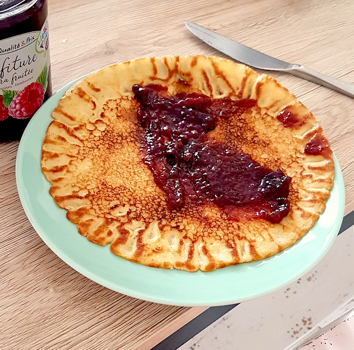

# Introduction
[Quark](https://en.wikipedia.org/wiki/Quark_(dairy_product)) is a popular dairy product. 
It could be seen as a thicker, more protein-rich and more sour version of yoghurt.
In practice, it is supposed to be a *cheese*, albeit a very soft one. 
Indeed, in Belgium this product is called *flat cheese* (plattekaas), and in France sometimes *fresh cheese* (fromage frais).
The stuff you find in the supermarket, conversely, is often not made following a cheese procedure, but made by concentrating milk in a [centrifuge](https://en.wikipedia.org/wiki/Centrifuge).
It turns out that making quark, as a cheese, is extremely easy, and the product you end up with is richer and more creamy than the one you buy in the supermarket.
(it is not, however, cheaper -- but again, you'll end up with a different product!).

What you need is:

1. Milk (1L)
2. Buttermilk (a tablespoon)
3. [Rennet](https://www.faie.ch/direkt-vermarktung/kaesereibedarf/kaesereiartikel/kaeselab-kulturen/7109464/kaeselab-50ml?c=78065003) (one drop)
4. [A cheesecloth](https://www.faie.ch/direkt-vermarktung/kaesereibedarf/kaesereiartikel/kaesereiartikel-literatur/7043352/kaesetuch-aus-baumwolle)
5. A sieve
6. A bowl

I found that, in Switzerland, it's not easy to find the required special ingredients (rennet and a cheese cloth). They can only be bought in two places, as far as I know: [faie.ch](faie.ch) and [winklerag.ch](winklerag.ch). 
Note that rennet and the cheese cloth can also be used for making other cheeses at home, e.g., [halloumi](https://www.youtube.com/watch?v=PPNQmV7roos).
You can thus use these products for other home-made dairy products!

# Recipe
## 1. Gather milk and buttermilk

Get a pack of one liter of milk (I recommend milk with 2+%, for a creamy taste). Get a pack from the cooled section of the supermarket. That is pasteurized milk, but not UHT.
Additionally, grab a small amount of buttermilk from the supermarket. This will contain acid and bacteria which will sour the milk further.

## 2. Acidify and culture

You "activate" the milk by adding a bit of the buttermilk, which will introduce acid and bacteria into the milk and turn the product sour and start the culturing process. You only need a tablespoon, which you simply add into the pack. Shake, and put it back down.

Close the pack of milk again, by putting the lid back on.

Wait for 12-24 hours.

## 3. Add rennet (start cheese-making)

We're now one day later, ready to curdle the "active" milk (i.e., to form little grains of the quark). Simply add one drop of rennet to the pack of milk, shake, and put the lid back on top again.

Wait for 1-2 more days (the longer you wait, the more "bitter" the taste becomes, as the rennet keeps working).

## 4. Drain quark through cheese cloth

It's now 1 or 2 days after you added the rennet. Prepare a cheese cloth in a sieve, over a large bowl. Pour in the product you've created. It may be relatively "wet" still, that's alright. What will happen is that the curds have separated from the whey.
The cheese cloth will let the whey drip through, and keep the quark in.

Let drain for 12 hours (overnight).

## 5. Scoop out quark

Your quark is now ready. Simply scoop it out of the cheese cloth into any container. It should survive in the fridge for a week, but it's tasty enough to eat it within that time!

## 6. (Optional) create pancakes

You'll notice that after starting off with one liter of milk, you end up with almost 2/3rds of a liter of whey (and water)! One of the uses for whey (if you don't want to throw it away) is to make pancakes. Take your ~600 ml of whey, add 300 g of plain white flour, 3 eggs, 2 table-spoons of sugar, a teaspoon of baking powder, half a teaspoon of salt, 4 tablespoons of vegetable oil. Add in your bowl, and mix together. Then heat up a pan on a very hot setting. Add butter to the pan, and a scoop of batter. With a small pan (21 cm diameter), that produces about 10 pancakes.
The pancakes will be nice and fluffy, and as delicious as pancakes made with milk!

Enjoy!
