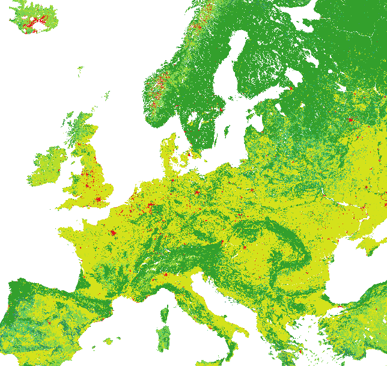

The [SYNMAP](https://www.bgc-jena.mpg.de/bgi/uploads/Publ/Publications/Jung_et_al_2006.pdf) dataset by Martin Jung is a land-cover dataset with a horizontal resolution of about 1 km. It can be used, for example, to estimate the ecosystem exchange between the atmosphere on the one hand, and vegetation processes on the other. 
An example of this is the VPRM preprocessing for WRF or STILT, which can be found here https://www.bgc-jena.mpg.de/bgc-systems/pmwiki2/pmwiki.php/Download/VPRMpreproc.

I wanted to obtain this entire map in its full resolution with Python, and found this process not entirely straightforward. However, I have figured it out, and share the dataset below accordingly.

It is generated as follows. The first step is to download the full SYNMAP binary file at https://www.bgc-jena.mpg.de/bgc-systems/pmwiki2/pmwiki.php/Download/VPRMpreproc under the text "*Original binary file of SYNMAP. It covers the whole globe.*" 

Then a Python script that processes this data is the following:

<!--  -->
```
import numpy as np
# Import the dataset (consisting of unsigned integers)
D = np.fromfile('synmap_LC_jan1.bin', dtype=np.uint8)
# Reshape into the correct shape for SYNMAP: rows of length 43200 and columns of length 17500
D = D.reshape((17500,43200))
# When interested, the associated longitude/latitude values are
lons = -180 + np.arange(43200) / 120
lats =   90 - np.arange(17500) / 120

# Write out as a GeoTIFF
import rasterio
with rasterio.Env():
    profile = profile = {'driver': 'GTiff', 
                         'width': 43200, 
                         'height': 17500, 
                         'count': 1, 
                         'transform' : rasterio.Affine(1/120, 0, -180, 0, -1/120, 90), 
                         # This transform is crucial, it maps the array-points
                         # D[0,0] to the world location (lon0,lat0)=(-180,90)
                         # D[1,0] to the world location (lon,lat)=(lon0,lat0)+(0,-1/120)
                         # D[0,1] to the world location (lon,lat)=(lon0,lat0)+(+1/120,0)
                         # Hence, it is what assigns locations to the array points
                         'crs': rasterio.crs.CRS.from_dict(init='epsg:4326'), 
                         'tiled': True, 
                         'compress': 'deflate', 
                         'dtype': rasterio.uint8}
    with rasterio.open('synmap.tif', 'w', **profile) as dst:
        dst.write(D.astype(rasterio.uint8), 1)
```

This creates a reasonably small GeoTIFF file (32MB, instead of the original 738+ MB) containing the SYNMAP dataset. You can for example download it here https://drive.google.com/file/d/1dj0uB5fqunbBoIeVbt-8BFzojqV2Bcbd/view?usp=sharing . Please cite the original authors if you use this dataset!

Loading it in QGIS (and setting appropriate values in the legend) will show, for example, 




