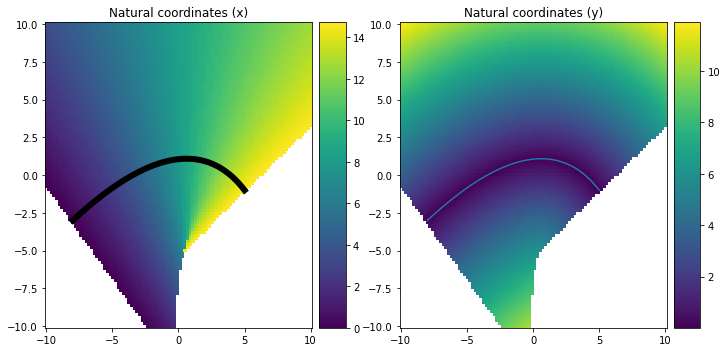

In the geosciences, one must be comfortable changing coordinate systems often. 
One new coordinate system I learned about is the [Natural coordinate system](https://www.youtube.com/watch?v=4lAPMcTRIRo), which essentially is chosen to lie tangential to a flowpath, and from a Cartesian point of view can be thought of as a curve in 2- or 3-D space, where each point of the curve is assigned a tangential direction ('x') and a normal direction 'y' (and if applicable, 'z').
It took me some time to figure out how to make such coordinate systems, which actually is rather useful for tasks such as Gaussian plume modeling, where the Gaussian plume is a function that is only defined in a natural coordinate system, so to position the Gaussian plume in any other direction we need a way to embed the natural coordinates into a Cartesian system.
I thought I'd explain a method to do just that, here. I bet there are other (nicer and more thought-out) ways to do this job, but the following works.

After thinking about the problem a bit, I realized I could make it work in the following way. First, define a Bézier curve of arbitrary order. For this, I used the `bezier` package (`pip install bezier`).
Then, the coordinates tangential to the line are found by computing for each point (lon, lat) the shortest Euclidean distance between that point and the curve. (The shortest Euclidean distance will always be perpendicular to the curve). Then assign that (lon, lat) coordinate the same value as the length of the Bézier curve -- helpfully supplied by the Bézier package!
The coordinates normal to the curve are even easier, because they correspond to the shortest Euclidean distance between the point (lon, lat) and the curve.
For a speed-up, I use a [kdtree](https://stackoverflow.com/a/48888264/4591046) to speed things up.

```python
import bezier
import scipy.spatial
import matplotlib.pyplot as plt
import numpy as np
from mpl_toolkits.axes_grid1.axes_divider import make_axes_locatable

def natural_coords(beziercurve, lon, lat, remove_limits=True):
    '''
    Create a 'natural coordinate' system w.r.t. a Bezier curve,
    where 'x_min' are coordinates tangential to the curve,
    where 'y_min' are coordinates normal to the curve.
    
    beziercurve is a Curve from the bezier class; 
    lon = 2D array of longitude coordinates (in meters)
    lat = 2D array of latitude coordinates (in meters)
    '''
    # --- Evaluate points on the Bezier curve, and length of the Bezier curve
    npts = 102
    if remove_limits:
        xp, yp = beziercurve.evaluate_multi(np.linspace(-1/(npts-2),1+1/(npts-2),npts))
        x_length = np.concatenate([[-1], np.linspace(0,beziercurve.length,npts-2), [-1]])
    else:
        xp, yp = beziercurve.evaluate_multi(np.linspace(0,1,npts))
        x_length = np.linspace(0,beziercurve.length,npts)

    # --- Get list of coordinates on the grid
    grid_coords = np.nan_to_num(np.vstack( (lon.ravel(), lat.ravel()) ).T)
    # --- Get list of coordinates on the curve
    curve_coords = np.vstack( (xp.ravel(), yp.ravel()) ).T
    # --- Find shortest Euclidean distance (using a KDTree)
    kdtree = scipy.spatial.KDTree(curve_coords)
    neighbours, idx = kdtree.query(grid_coords)
    # --- Find minimum X and Y distances
    y_min = neighbours.reshape(lon.shape)
    x_min = x_length[idx].reshape(lon.shape)
    # Remove the values that lie beyond the natural coord. system
    if remove_limits:
        y_min = np.where( x_min==-1, np.nan, y_min)
        x_min = np.where( x_min==-1, np.nan, x_min)
    return x_min, y_min


# --- Create lon, lat, Beziercurve
lon, lat = np.meshgrid(np.linspace(-10,10,100), np.linspace(-10,10,100))
nodes = np.asfortranarray([
    [-8, 0.625, 5.0],
    [-3, 4  , -1],
    ])
curve = bezier.Curve.from_nodes(nodes)

# --- Generate the 'natural coordinate system'
xn, yn = natural_coords(curve, lon, lat, remove_limits=True)

# --- The rest is just about plotting!
fig, ax = plt.subplots(1,2,figsize=(10,5))
im0 = ax[0].pcolor(lon, lat, xn)
ci0 = curve.plot(num_pts=100, ax=ax[0], color='k')
ci0.get_lines()[0].set_linewidth(6)
ax[0].set_title('Natural coordinates (x)')
im1 = ax[1].pcolor(lon, lat, yn)
curve.plot(num_pts=100, ax=ax[1])
ax[1].set_title('Natural coordinates (y)')
plt.tight_layout()
divider0 = make_axes_locatable(ax[0])
cax0 = divider0.append_axes('right', size='10%', pad=0.1)
fig.colorbar(im0, cax=cax0, orientation='vertical')
divider1 = make_axes_locatable(ax[1])
cax1 = divider1.append_axes('right', size='10%', pad=0.1)
fig.colorbar(im1, cax=cax1, orientation='vertical')
```

That results in the following figure, which shows the tangential (x) and **unsigned** (!) normal (y) coordinates.



The Bézier package allows many further nice things, such as evaluating *exactly* the normal and tangential vector components of the flow field. For example 
```python
s = 0.75
x, y = curve.evaluate(0s)
tangent_vec2 = curve.evaluate_hodograph(0.75)
tangent_vec = tangent_vec2 / np.linalg.norm(tangent_vec2)
normal_vec = np.array([tangent_vec[1], -tangent_vec[0]])
curvature = bezier.hazmat.curve_helpers.get_curvature(nodes, tangent_vec2, s)
move_distance = normal_vec * 1/(curvature)
circle1 = plt.Circle((x-move_distance[0], y-move_distance[1]), 1/np.abs(curvature), color='r', fill=False)

# --- The plotting routine...
fig, ax = plt.subplots(1,2,figsize=(10,4.5))
im0 = ax[0].pcolor(lon, lat, xn)
ci0 = curve.plot(num_pts=100, ax=ax[0], color='k')
ci0.get_lines()[0].set_linewidth(6)
ax[0].set_title('Natural coordinates (x), with tangential and normal lines')
im1 = ax[1].pcolor(lon, lat, yn)
curve.plot(num_pts=100, ax=ax[1])
ax[1].set_title('Natural coordinates (y), with curvature for the point')
plt.tight_layout()
divider0 = make_axes_locatable(ax[0])
cax0 = divider0.append_axes('right', size='10%', pad=0.1)
fig.colorbar(im0, cax=cax0, orientation='vertical')
divider1 = make_axes_locatable(ax[1])
cax1 = divider1.append_axes('right', size='10%', pad=0.1)
fig.colorbar(im1, cax=cax1, orientation='vertical')
ax[0].plot(x,y, 'rv')
ax[0].plot([x-5*tangent_vec[0], x+5*tangent_vec[0]], [y-5*tangent_vec[1], y+5*tangent_vec[1]], 'r', linewidth=3)
ax[0].plot([x-2*normal_vec[0], x+2*normal_vec[0]], [y-2*normal_vec[1], y+2*normal_vec[1]], 'w', linewidth=3)
ax[1].plot(x,y, 'rv')
ax[1].add_patch(circle1)
```

can be used to compute the tangential vector, normal vector, and curvature, for a point `s=0.75`, thus at three-quarters along the line!


