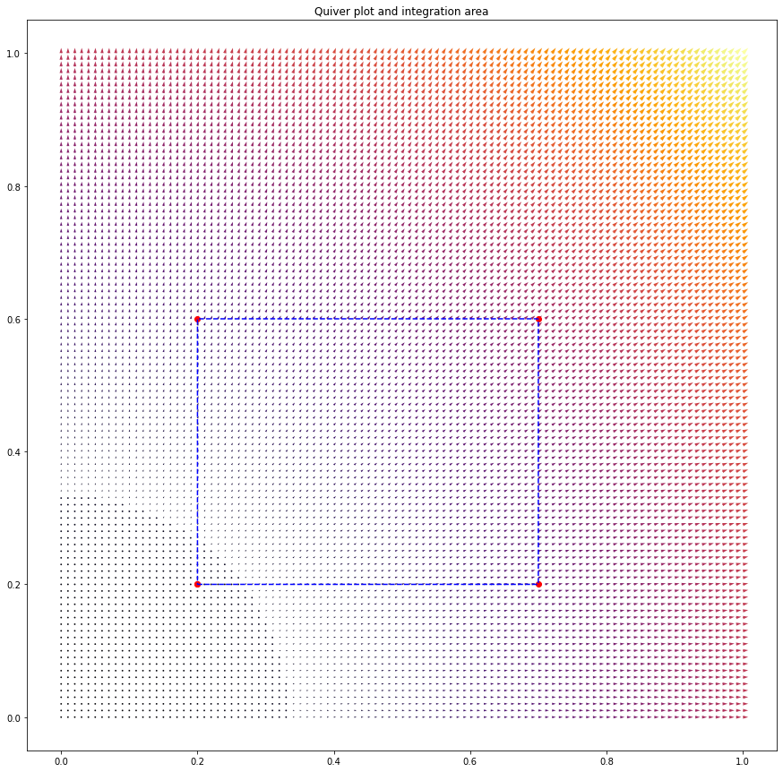

According to the divergence theorem (in 2D), the volume integral of the divergence of a 2D vector $\mathbf{F}=(F_x,F_y)^T$ written as $\iint_V \nabla\cdot \mathbf{F} \,\mathrm{d}V$ equals the line integral enclosing the volume, $\oint_{\partial V}\mathbf{F}\cdot \,\mathbf{n} \mathrm{d}S=\oint_{\partial V} (F_x \,\mathrm{d}y - F_y \,\mathrm{d}x)$ with $\mathbf{n}$ a unit vector.

I wanted to test this theorem in Python, so wrote the following code to compute these two integrals. It's fairly general and will allow arbitrary vector fields.

```python
# Create a vector field, and a set of points to interpolate over
import numpy as np
import matplotlib.pyplot as plt
from scipy.interpolate import interp1d # Different interface to the same function
from scipy.interpolate import splprep, splev, interp2d, NearestNDInterpolator, LinearNDInterpolator
from matplotlib.path import Path
from collections import Counter

def return_closed_curve(pts, k=1, npts=1000):
    '''
    Compute x and y coordinates for a closed curve, given points in pts
    k=1 gives a linear interpolation, k=3 a cubic spline (=smoother).
    pts_i = x_i, y_i; i.e., pts=2xN array of 2D points.
    The output is regularly spaced in Euclidean space (i.e. dx^2+dy^2 is constant).
    Based on https://stackoverflow.com/a/31466013/4591046
    '''
    tck, u = splprep(pts.T, u=None, s=0.0, per=1, k=k)
    u_new = np.linspace(u.min(), u.max(), npts)
    x, y = splev(u_new, tck, der=0)
    return x, y


def create_mask(X, Y, x, y):
    '''
    Create a matrix mask based on a polygon mask defined on an unstructured grid
    based, but modified to allow unstructured grids, on
    https://stackoverflow.com/a/51208705/4591046
    '''
    width, height=X.shape
    polygon = list(zip( x, y))
    poly_path=Path(polygon)
    coors=np.hstack((X.reshape(-1, 1), Y.reshape(-1, 1)))
    mask = poly_path.contains_points(coors).reshape(height, width)
    return mask


def half_mask_at_edges(mask, axis=0):
    '''
    This function takes a mask, e.g., for axis=1 (horizontal)
    mask = [[0  0  0  0  0],
            [0  1  1  1  0],
            [0  1  1  0  0],
            [0  0  1  0  0],
            [0  0  0  0  0]]
    and converts it to
    mask0= [[0  0  0  0  0],
            [0 .5  1 .5  0],
            [0 .5  .5 0  0],
            [0  0  1  0  0], <- note this special case!
            [0  0  0  0  0]]
    which is a required pre-conditioning step before supplying the masked data to
    a trapz integration, because the integration boundaries should only account 
    for '1/2' the amount of their dx/dy values.
    '''
    mask0 = mask.astype(float)      # Deal with the mask in floating point fashion

    x0 = np.arange(mask0.shape[0])  # Create array with x indices
    y0 = np.arange(mask0.shape[1])  # Create array with y indices

    if axis==0:
        locsX = x0[:-1, np.newaxis]+1/2 + np.diff(mask0*1, axis=0)/2
        difX = np.where(locsX*10%10==0, locsX.astype(int), 0)
        XX = [loc for loc in difX.flatten() if loc!=0]
        XY = np.nonzero(difX)[1]
        # Deduplicate items
        Xcoords = list(zip(XX, XY))
        nits = Counter(Xcoords)
        Xcoords = [k for k, v in nits.items() if v == 1]
        try:
            XX, XY = list(zip(*Xcoords))
        except:
            XX = XY = []
        mask0[(XX), (XY)] = 0.5
    elif axis==1:
        locsY = y0[np.newaxis, :-1]+1/2 + np.diff(mask0*1, axis=1)/2
        difY = np.where(locsY*10%10==0, locsY.astype(int), 0)
        YY = [loc for loc in difY.flatten() if loc!=0]
        YX = np.nonzero(difY)[0]
        Ycoords = list(zip(YX, YY))
        nits = Counter(Ycoords)
        Ycoords = [k for k, v in nits.items() if v == 1]
        try:
            YX, YY = list(zip(*Ycoords))
        except:
            YX = YY = []
        mask0[(YX), (YY)] = 0.5
        
    return mask0


def divergence(Vx, Vy, x, y):
    '''
    Compute the divergence of a 2D field [Vx, Vy].T
    known on Cartesian coordinates [x, y]
    (i.e., x is axis 0, y is axis 1)
    '''
    ddx, _ = np.gradient(Vx, x, y)
    _, ddy = np.gradient(Vy, x, y)
    return ddx + ddy


def NNintp(Xgrid, Ygrid, Zgrid, xpts, ypts, method='NN'):
    '''
    Do a nearest neighbour interpolation of Z(X,Y) on an, in principle, unstructured grid.
    Xgrid_{i,j} = Xgrid(i,j), 2D array of X coordinates
    Ygrid_{i,j} = Ygrid(i,j), 2D array of Y coordinates
    Zgrid_{i,j} = Z(Xgrid_{i,j}, Ygrid_{i,j}), array of ordinates
    xpts_i = array of x coordinates interpolated to
    ypts_i = array of y coordinates interpolated to
    '''
    if method == 'NN':
        Z_itp = NearestNDInterpolator(list(zip(Xgrid.ravel(), Ygrid.ravel())), Zgrid.ravel())
    elif method == 'linear':
        Z_itp = LinearNDInterpolator(list(zip(Xgrid.ravel(), Ygrid.ravel())), Zgrid.ravel())
    else:
        print('Unknown method, should be "NN" or "linear"')
        return 0
    return np.squeeze([Z_itp(x, y) for x, y in zip(xpts, ypts)])


def line_integral(Vx, Vy, x, y):
    '''
    Compute the line integral of a 2D vector-valued function [Vx, Vy].T
    multiplied with an outward pointing normal 'n', on a Cartesian grid.
    \oint V . n dS = \oint (Vx*dy - Vy*dx)
    
    Vx_i = Vx(x_i,y_i)
    Vy_i = Vy(x_i,y_i)
    x_i = array of x_coordinates
    y_i = array of y_coordinates    
    '''
    dx_f = np.diff(x)
    dy_f = np.diff(y)
    Vx_avg = (Vx[1:] + Vx[:-1])/2
    Vy_avg = (Vy[1:] + Vy[:-1])/2
    return (Vx_avg * dy_f - Vy_avg * dx_f).sum()


############################################## STEP 1: DEFINE THE INPUT SPACE AND VECTOR FIELD
# Grid
x = np.linspace(0,1,101)
y = np.linspace(0,1,101)
X, Y = np.meshgrid(x, y, indexing='ij')

# Vector field
Vx = X
Vy = Y

############################################## STEP 2: SET THE AREA OF INTEGRATION
# Points for the closed line integral
pts=np.asarray([
    [0.2, 0.2],
    [0.7, 0.2],
    [0.7, 0.6],
    [0.2, 0.6],
    [0.2, 0.2]
])

x_line, y_line = return_closed_curve(pts, npts=1000, k=1)

# Plot the intermediate results -- starts to be memory intensive for large x/y arrays!
plt.figure(figsize=(15,15))
plt.quiver(X, Y, Vx, Vy)
plt.plot(pts[:,0], pts[:,1], 'ro')
plt.plot(x_line, y_line, 'b--')
plt.title('Quiver plot and integration area')
plt.show()

############################################## STEP 3: NUMERICALLY COMPUTE THE AREA INTEGRAL \iint \nabla\cdot V dA
DIV = divergence(Vx, Vy, x, y)
# Apply factor 1/2 at edges of the mask (in y direction)
mask = create_mask(X, Y, x_line, y_line)
mask_ax1 = half_mask_at_edges(mask, axis=1)
DIV_int = np.trapz( DIV*mask_ax1 , dx=y[1]-y[0], axis=1)
# Apply factor 1/2 at edges of the mask (in x direction)
mask_sum = mask.sum(axis=1)!=0
mask_ax0 = half_mask_at_edges( mask_sum[:,np.newaxis] ).squeeze()
DIV_int = np.trapz( DIV_int*mask_ax0 , dx=x[1]-x[0]        )
print("Volume integral of divergence gives: ", DIV_int)
# This volume integral isn't fully correct, because it doesn't take into account the 'degree of overlap'
# between the polygon of integration and each 2D surface element. 

############################################## STEP 4: NUMERICALLY COMPUTE THE LINE INTEGRAL \iint V\cdot n dA
Vx_itp = NNintp(X, Y, Vx, x_line, y_line, method='NN')
Vy_itp = NNintp(X, Y, Vy, x_line, y_line, method='NN')
LIN_int = line_integral(Vx_itp, Vy_itp, x_line, y_line)
print("Line integral of the line integral : ", LIN_int)
```

For the chosen vector field $F=(x,y)^T$, and the chosen domain shown below,



I numerically find a volume integral value of `0.38140000000000013` and a line integral value of `0.39999999999999997`. Given that the analytical answer is `0.4`, the results are pretty good. I'm impressed by just how well the line integral performs in particular.

The volume integral can probably be improved upon, because the method is not taking into account the degree of overlap between grid of points and the polygon describing the volume. Fixing this is not impossible, but gets time-intense quite quickly, I think.

Anyhow, this method easily extends to more complicated shapes for which I wouldn't know the analytical answer, (set `x_line, y_line = return_closed_curve(pts, npts=1000, k=3)`),


giving `0.6022000000000002` for the volume integral, and `0.6182731693440393` for the line integral. When changing the number of `x` and `y` points from `101` to `1001`, I find `0.6164499999999999` and `0.617788105206478` respectively, thus with the volume integral solution moving in the direction already obtained with the line integral...indicating again how accurate the line integral is, to my surprise!
